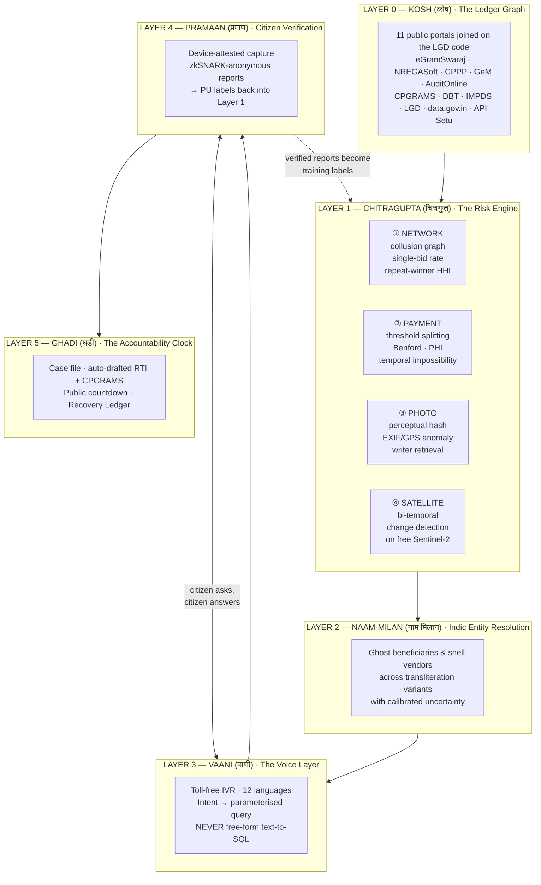
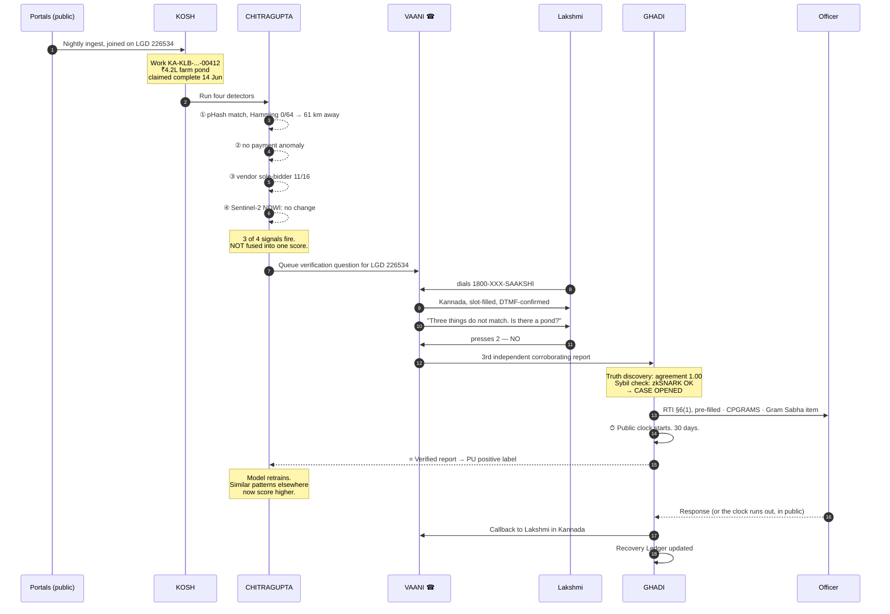

# idea.md — SAAKSHI (साक्षी)

### *The witness for every rupee.*

**Submission for:** TechGig × Optum — *Inclusive Innovation for Bharat*
**Theme:** 05 — GovTech & Public Service Delivery
**License:** MIT (as required)
**Evidence base:** every claim in this document traces to `RESEARCH.md`

> **This document contains ONLY the idea.** No implementation steps, no code, no build order. That is `PLAN.md`.

---

## Table of Contents

- [1. The one-sentence version](#1-the-one-sentence-version)
- [2. The moment this idea came from](#2-the-moment-this-idea-came-from)
- [3. Meet Lakshmi](#3-meet-lakshmi)
- [4. The problem, in five acts](#4-the-problem-in-five-acts)
- [5. The core insight](#5-the-core-insight)
- [6. What SAAKSHI is](#6-what-saakshi-is)
- [7. The six layers, each with worked examples](#7-the-six-layers-each-with-worked-examples)
  - [Layer 0 — KOSH: the ledger graph](#layer-0--kosh-the-ledger-graph)
  - [Layer 1 — CHITRAGUPTA: the risk engine](#layer-1--chitragupta-the-risk-engine)
  - [Layer 2 — NAAM-MILAN: Indic entity resolution](#layer-2--naam-milan-indic-entity-resolution)
  - [Layer 3 — VAANI: the voice layer](#layer-3--vaani-the-voice-layer)
  - [Layer 4 — PRAMAAN: the citizen verification loop](#layer-4--pramaan-the-citizen-verification-loop)
  - [Layer 5 — GHADI: the accountability clock](#layer-5--ghadi-the-accountability-clock)
- [8. The full walkthrough: one case, end to end](#8-the-full-walkthrough-one-case-end-to-end)
- [9. What makes this novel](#9-what-makes-this-novel)
- [10. What SAAKSHI deliberately does NOT do](#10-what-saakshi-deliberately-does-not-do)
- [11. Why this is inclusive, not just clever](#11-why-this-is-inclusive-not-just-clever)
- [12. Impact model](#12-impact-model)
- [13. Scalability and sustainability](#13-scalability-and-sustainability)
- [14. Alignment with national priorities](#14-alignment-with-national-priorities)
- [15. Risks, and honest answers](#15-risks-and-honest-answers)
- [16. Rubric map](#16-rubric-map)
- [17. The name](#17-the-name)

---

## 1. The one-sentence version

> **SAAKSHI joins eleven public Indian government portals into a single evidence graph, runs four independent forensic detectors over it — network collusion, payment structure, photo forensics, and satellite change detection — and then lets any citizen call a toll-free number in their own language to ask what was spent in their village, see the flags, verify the asset with their own eyes, and start a clock the government has to answer.**

The three-part claim underneath it:

1. **India already publishes enough data to catch most of its own leakage.** It is scattered across eleven portals, but it is public.
2. **The detection techniques CAG used to catch ₹1.19 crore of fraud in a 39-panchayat sample are all batch jobs.** CAG did them by hand.
3. **The person best placed to verify whether a pond exists is the person who walks past it.** She has never been asked, because every transparency portal in India requires a smartphone, literacy, and English — and 51.6% of rural women over 15 don't own a phone.

---

## 2. The moment this idea came from

In March 2026, the Comptroller and Auditor General tabled a performance audit of MGNREGA in Karnataka. Buried in the housing-works section is this:

> Auditors scrutinised **847 projects worth ₹1.91 crore** and found **₹1.19 crore misappropriated**. Irregularity rates in sampled works ran **56% to 99%**. There were **462 instances** of payments for foundation, lintel and roofing stages **on houses that were already finished**. There were **12 cases where no work was executed at all** and payment was processed anyway.
>
> They caught it because **identical photographs had been uploaded across different construction stages** to fake progress.
>
> And they caught the phantom houses because the auditors **opened Google Earth** and looked.

*(CAG performance audit tabled in the Karnataka legislature, March 2026 — see `RESEARCH.md` §A1.3 for sourcing and caveats.)*

Now read the four detection methods again:

| What CAG did, by hand, over months | What it actually is |
|---|---|
| Noticed the same photograph across different "stages" | **Perceptual hashing.** Forty lines of Python. Millions of images in hours. |
| Opened Google Earth to see if a structure existed | **Bi-temporal satellite change detection.** Free Sentinel-2. Published open models. |
| Spotted a check dam split into two works to dodge the tender threshold *(Koppal, Yelburga taluk)* | **Threshold-splitting detection.** A `GROUP BY` and a histogram. |
| Found materials "purchased after project completion" *(Kalaburagi solid-waste shed)* | **Temporal consistency check.** A date comparison. |

**Every single one is a batch job.** Not one of them is running anywhere in India today.

And then the line that turns this from an observation into a mission. From the same CAG report:

> **"Social audits failed to detect any discrepancies."**

The system designed to catch this missed it. The auditors caught it by hand, in a sample. And this was **39 gram panchayats out of 255,402**.

---

## 3. Meet Lakshmi

Lakshmi is 42. She lives in a village in Kalaburagi district, Karnataka. She works under MGNREGA when work is available. She has a job card. She cannot read English. She reads Kannada slowly. She does not own a smartphone — her son does, and he works in Bengaluru.

Here is what is true about Lakshmi's village right now, and what she can do about it:

| Fact | Where it is published | Can Lakshmi see it? |
|---|---|---|
| Her panchayat was sanctioned ₹4.2 lakh for a farm pond in March | eGramSwaraj + NREGASoft | Technically yes. Practically no. |
| The pond was marked "completed" in June | NREGASoft | No |
| The geo-tagged completion photo is identical to the photo from a different work 60 km away | NMMS image store | **Nobody has ever looked** |
| Satellite imagery shows no change at those coordinates between March and June | Free, on Copernicus | **Nobody has ever looked** |
| The contractor won 11 of the last 16 tenders in the block, all 11 as the only bidder | CPPP bid awards | **India publishes no single-bid rate. Nobody has ever computed this.** |
| A social audit observation was recorded against this panchayat | AuditOnline | Yes — and **zero Action Taken Reports have ever been generated nationally** |
| ₹1,000+ crore of MGNREGA misappropriation has been detected in six years | Government data | **Under 13% recovered. ~₹878 crore untraced** |

Lakshmi walks past the place where the pond is supposed to be, twice a day.

**She is the highest-resolution sensor in the entire system, and nobody has ever asked her a question.**

---

## 4. The problem, in five acts

### Act I — The data is public but shattered

Eleven portals. eGramSwaraj, NREGASoft, CPPP, GeM, AuditOnline, CPGRAMS, DBT Bharat, IMPDS, LGD, data.gov.in, API Setu. Each one is real, each one is public, none of them talk to each other.

A citizen cannot ask *"what did my panchayat receive across all schemes this year?"* from any single place — **even though LGD codes have been the mandated universal location key across all e-Government applications since 4 November 2016**, covering 255,297 gram panchayats and 677,042 villages.

The join key exists. Nobody has done the join.

### Act II — The evidence is collected and never examined

NMMS forces every MGNREGA worksite to upload **twice-daily geo-tagged photographs**. AwaasSoft does the same for housing. This is a corpus of **millions of images**, funded and collected by the state.

**No perceptual-hash duplicate detection runs on it. No EXIF/GPS anomaly screening runs on it. No satellite-vs-claim comparison runs on it.**

Meanwhile NMMS made attendance *harder for honest workers* — a Telangana worker in Mahabubabad couldn't mark attendance after shaving his head, because face-match rejected him — and **no harder at all for a dishonest supervisor recycling a photograph.** Surveillance was added without verification.

### Act III — Detection is supply-constrained

Social audits are statutorily universal. In FY2025-26 they covered **38.58% of 2,69,243 panchayats** — and that partial coverage still surfaced **61,347 separate cases of misappropriation**.

India is not failing to find corruption because corruption is hard to find. **It is failing because there aren't enough auditors, and the ones there are do the work by hand.**

### Act IV — Findings go nowhere

This is the single most damning table in Indian GovTech. AuditOnline, the Ministry of Panchayati Raj's own platform, FY2025-26, verified live:

| Metric | Value |
|---|---|
| Enlisted auditees | **262,202** (incl. **255,402 gram panchayats**) |
| Observations recorded | **62,745** |
| Audit reports generated | 5,657 — **2.2%** |
| **Settlement reports generated** | **0** |
| **Action Taken Reports** | **0** |

The government built the platform. It onboarded a quarter of a million panchayats. It recorded sixty-two thousand audit observations. **And it closed zero of them.**

Recovery on detected MGNREGA misappropriation stands at **under 13%**. Roughly **₹878 crore is untraced**.

### Act V — The people who could fix it cannot reach it

Every transparency channel in India — Meri Panchayat, CPGRAMS, eGramSwaraj, AuditOnline — is **app-or-web-first**.

| Reality | Number |
|---|---|
| Household smartphone penetration | **85.5%** |
| **Rural women 15+ who own a mobile phone** | **48.4%** |
| **Rural women 15+ who can send a message with an attached file** | **50.9%** |
| Indians whose mother tongue is not Hindi | **~56%** |
| Rural literacy | 77.5% (rural Bihar female: **65%**) |
| **Inbound voice/IVR channels for scheme spending data in India** | **Zero. None exist.** |

> **Household smartphone penetration is 85.5%. But fewer than half of rural women over 15 own a phone. Any welfare-transparency app that assumes personal device ownership excludes the single largest group of welfare beneficiaries in the country.**

---

## 5. The core insight

Three observations that only become powerful together.

### Insight 1 — India has world-class plumbing and almost no forensics

Look at what the government itself claims. The DBT dashboard says it deleted **6.36 crore fake ration cards**, **4.09 crore fake LPG connections**, and **1.32 crore fake MGNREGA job cards**, for total estimated gains of **₹5,14,201.92 crore**.

That is real, and it is impressive. But look at what it *is*: **deduplication**. Deduplication stops *future* theft. It does not:

- recover money already taken (**recovery is under 13%**)
- identify who took it
- verify whether the asset that was paid for actually exists

India built Aadhaar, DBT, PFMS, UPI — extraordinary payment rails. **It never built the forensics layer that sits on top.** The state can now move money to the right person's account. It still cannot tell you whether the pond got dug.

### Insight 2 — The auditor's methods are all automatable, and the auditor is the bottleneck

CAG's four detection techniques are, computationally, a perceptual hash, a raster diff, a `GROUP BY`, and a date comparison. There is no research frontier here. **The bottleneck is not capability. It is that 38.58% coverage of panchayats is the most humans can manage.**

An official quoted by DT Next estimated that **at 75% coverage, detected misappropriation would cross ₹250 crore in a single year.**

Compute does not get tired.

### Insight 3 — The citizen is both the missing sensor and the missing label

This is the part that turns SAAKSHI from a dashboard into a research contribution.

Every machine-learning system for procurement fraud hits the same wall, stated most clearly in the 2025 Mexico study (arXiv:2512.19491): **there are no confirmed negatives, and confirmed positives are vanishingly rare.** You never learn that a contract was clean. You only occasionally learn that one was dirty, years later, after a court case. This is why the entire field is stuck at Positive-Unlabeled learning with a handful of sanction records as the only ground truth.

Meanwhile, Lakshmi walks past the pond twice a day.

> **A verified citizen report is a ground-truth label.**
>
> "The satellite says no change. The photo is a duplicate. The contractor won 11 of 16 tenders unopposed. And a woman who lives 200 metres away, cryptographically anonymous, says there is no pond."
>
> That is not a complaint. **That is a labelled training example** — the exact thing the literature says does not exist.

Nobody has published this loop. It is Novelty Gap N2 in `RESEARCH.md`.

---

## 6. What SAAKSHI is

**SAAKSHI is a read-only forensic and accountability layer that sits on top of India's existing public spending data — and a toll-free phone number that lets any citizen interrogate it in their own language.**

Six layers:



The names are not decoration. **Chitragupta** is the divine accountant of Indian tradition, who records every deed in a ledger. **Saakshi** is the witness whose testimony makes a fact admissible. The system is named after the two functions it performs.

---

## 7. The six layers, each with worked examples

### Layer 0 — KOSH: the ledger graph

**कोष — treasury, repository.**

**What it does.** Ingests eleven public sources and joins them into one heterogeneous property graph, keyed on the LGD code.

**Why the LGD code is the whole game.** The Cabinet Secretariat mandated LGD codes as the standard location code across all e-Government applications on **4 November 2016**. Every portal uses them. LGD covers **36 States/UTs, 784 districts, 7,323 blocks, 677,042 villages, 255,297 gram panchayats** and is available as a **bulk download plus a NAPIX API**.

**Because of that one 2016 circular, joining eleven government portals is a merge on an integer.** Without it, this project is impossible. With it, it's an afternoon.

**The node types:**

| Node | Example | Source |
|---|---|---|
| `Panchayat` | Kamalapur GP, Kalaburagi, Karnataka (LGD 226534) | LGD |
| `Work` | "Farm pond, survey no. 112/3", sanctioned ₹4.2L | NREGASoft, eGramSwaraj |
| `Contract` | Tender ID 2026_RDPR_812443_1 | CPPP |
| `Vendor` | "Shri Basava Constructions" | CPPP awards, GeM |
| `Payment` | ₹1.4L, 12 Mar 2026, stage: foundation | NREGASoft FTO |
| `Photo` | geo-tagged JPEG, lat/lon, timestamp | NMMS, AwaasSoft |
| `Beneficiary` | **pseudonymous ID only — never a name, never an Aadhaar number** | derived |
| `AuditObservation` | "materials purchased after completion" | AuditOnline |
| `Grievance` | CPGRAMS ticket | pgportal |
| `CitizenReport` | "no pond here" — anonymous | Layer 4 |
| `SatelliteObservation` | Sentinel-2 tile, NDWI delta | Copernicus |

**Worked example — what one question looks like today vs with KOSH:**

> **Question:** *"What was my panchayat paid across all schemes this year, and what was it supposed to build?"*
>
> **Today:** Open eGramSwaraj for the plan. Open NREGASoft for the works — but the deep link fails with "URL Tampered", so navigate manually through an ASP.NET postback form. Open CPPP separately for the tenders. Open AuditOnline for observations. Cross-reference by hand. Portal names are in English. There is no single answer.
>
> **With KOSH:** one graph traversal from a single `Panchayat` node.

---

### Layer 1 — CHITRAGUPTA: the risk engine

**चित्रगुप्त — the keeper of the ledger of deeds.**

Four **independent** detectors. Critically, they are **never fused into a single "corruption score."**

> **Why no single score.** An Item Response Theory validation of 15 red-flag indicators on Italy's National Database of Public Contracts (arXiv:2309.01462) found that **red flags are multidimensional and non-superimposable — a single composite corruption risk index is statistically unjustified.**
>
> So SAAKSHI shows four separate, independently evidenced signals and lets a human weigh them. A number that says "risk: 0.87" is a number nobody can argue with. Four sentences that say *what was found* is something an officer can rebut and a citizen can check.

#### ① Network detector — the collusion graph

Builds the buyer–supplier–co-bidding network from CPPP bid awards and computes the standard World Bank / DIGIWHIST red flags **that India has never published**:

- **single-bid rate** — the headline indicator worldwide; **no Indian body publishes it**
- **repeat-winner concentration (HHI)** by procuring entity
- **award-value-vs-estimate variance**
- **tender advertisement-period shortening**
- **network core membership and supplier eigenvector centrality**

Model choice is deliberately boring: **LightGBM on graph-derived features first**, because GADBench (arXiv:2306.12251, 29 models × 10 datasets up to 6M nodes) found **tree ensembles with simple neighborhood aggregation outperform the latest task-specific GNNs.** A Graph Attention Network is the *challenger*, justified by arXiv:2507.12369 achieving **91% cross-market accuracy** on bid-rigging across 13 markets in 7 countries — but it must beat the boring baseline to ship.

Labels come from Positive-Unlabeled learning (arXiv:2512.19491: **+32% more known positives, 2.3× better than random**), seeded from CAG findings and — this is the novel part — **from verified citizen reports in Layer 4.**

> **Worked example.** Block-level output for Yelburga taluk, Koppal:
>
> | Vendor | Tenders won | Won as sole bidder | Avg. award vs estimate | Core membership |
> |---|---|---|---|---|
> | Shri Basava Constructions | 11 of 16 | **11** | **+2.1%** | 0.91 |
> | Peer median in block | 2 of 16 | 0 | −8.4% | 0.12 |
>
> Eleven unopposed wins out of sixteen, awarded at consistently just-above-estimate. In EU procurement analysis this is a textbook single-bidder red flag. **In India it has never been computed for any block, because nobody publishes bid-award analytics.**

#### ② Payment detector — no labels required

Runs entirely unsupervised on the payment ledger. Four checks:

**(a) Threshold splitting.** Cluster award amounts just below each statutory tender threshold. *This is the exact Koppal check-dam fraud CAG found: a work split into two smaller works to bypass tendering.* A histogram with a bump immediately below ₹X lakh is a fingerprint.

**(b) Benford's law** on bill and invoice amounts. First-digit distribution deviation.

**(c) Payment Heterogeneity Index** (arXiv:2605.12547) — structural anomaly in *post-award payment patterns*, unsupervised and interpretable. On UK municipal data it flagged **0.6% of suppliers and 10.1% of high-volume vendors** as structurally distinct, revealing regimes that a simple coefficient-of-variation misses.

**(d) Temporal impossibility.** Materials purchased *after* completion. Stage payments on already-finished houses. Muster-roll dates outside the work's sanction window.

> **Worked example.** *The 462.*
>
> CAG found **462 instances of foundation/lintel/roofing payments on houses that were already completed.** As a query, this is:
>
> `payment.stage_date > work.completion_date` — grouped by work.
>
> That is a single date comparison. Four hundred and sixty-two of them, in one district, in one scheme. **This check does not run anywhere in India.**

#### ③ Photo forensics — the images the state already owns

The corpus exists. NMMS and AwaasSoft collect millions of geo-tagged photographs. Four checks:

**(a) Perceptual hashing (pHash/dHash).** Near-duplicate detection across the entire corpus.

> **This is the CAG "identical photographs uploaded across different construction stages" fraud.** CAG caught it visually, in a sample of 847 projects. pHash catches it across millions of images, automatically, in hours. **This one check is the single highest value-per-line-of-code item in the entire system.**

**(b) EXIF / GPS anomaly screening.**
- Photo GPS vs the work's LGD-declared location — a completion photo 60 km from the work site
- Timestamp vs muster-roll date
- **Camera-model and device clustering** — one phone marking "attendance" at eight worksites within one hour

**(c) Tamper localization.** DINOv3-based image forensics (arXiv:2604.16083) — **+17.0 pixel-level F1 over prior SOTA with only 9.1M trainable params on a frozen ViT-L**, robust to JPEG recompression and blur. Directly relevant to the Kalaburagi case where CAG found **geo-tagged images tampered with**.

**(d) ⭐ Writer retrieval on scanned muster rolls — the cheapest novel win available.**

Handwritten Indian names cannot be reliably OCR'd. The closest published analogue — Swiss popular-initiative signature lists (arXiv:2606.05018) — reports **CER 29.6% on handwritten first names.** Off-the-shelf OCR simply does not work.

**But the same paper reports writer retrieval at mAP 50.6%, and shows it is effective for detecting duplicate submissions via handwriting similarity.**

> **So don't read the names. Detect that one hand wrote forty rows.**
>
> *"One supervisor forged the whole muster roll"* is a known, common MGNREGA fraud. It is invisible to OCR. It is visible to writer retrieval. **Nobody has ever applied writer retrieval to Indian muster rolls** (Novelty Gap N7).

#### ④ Satellite detector — and its honest limits

Bi-temporal change detection on **free Sentinel-2 (10 m, ~5-day revisit)**, anchored to the sanction date and the completion-claim date of each work.

Techniques: unsupervised building change detection (SST-CD, arXiv:2606.10775 — **label-free, F1 83.08% LEVIR-CD / 91.69% WHU-CD**, which matters because there is no labelled Indian building-change data), plus open-vocabulary change detection (Seg2Change, arXiv:2604.11231) so "pond" or "road" can be queried **without retraining**.

> ### ⚠️ The limit, stated plainly — because overclaiming here is how you lose a technical judge
>
> **At 10 m ground sample distance, one pixel is 100 m².**
>
> | Asset | Detectable from free satellite? |
> |---|---|
> | Rural toilet (~1.5 × 1.5 m) | ❌ **Physically invisible** |
> | Hand pump | ❌ **Physically invisible** |
> | Single house extension | ❌ **Physically invisible** |
> | Road (linear, tens of m over km) | ✅ Yes |
> | Farm pond / check dam | ✅ Yes — strong NDWI water signature |
> | Land levelling / bunding | ✅ Yes |
> | Cluster of new houses | ✅ Yes |
>
> This is a **physical limit, not a modelling limit.** No model fixes it.
>
> It gets worse, honestly: Prithvi-EO-2.0 deployed across 19 out-of-distribution events achieves **IoU 52% on cropland but IoU ≈ 4% on built-up areas** (arXiv:2606.07780). All geospatial foundation models lose **15–20% out-of-distribution regardless of architecture** (arXiv:2605.29330). And a 152-paper audit found **46 cross-paper disagreements of ≥10 points on identical setups**, with **39% of papers releasing no weights** (arXiv:2605.12678).
>
> **Therefore SAAKSHI scopes satellite verification to large linear and areal assets only, and treats a "no observable change" result as a TRIGGER FOR HUMAN VERIFICATION — never as a verdict.** Small assets skip satellite entirely and go straight to Layer 4.
>
> Anyone who claims to verify toilets from free satellite imagery is lying. We say so on the slide.

---

### Layer 2 — NAAM-MILAN: Indic entity resolution

**नाम मिलान — name matching.**

**The premise.** The two central fraud mechanisms in Indian welfare are *"the same person under three spellings"* and *"the same contractor under four registrations."* Both are entity resolution problems.

CAG found that **about 60% of registered MGNREGA workers in Karnataka were not active**, and attributed it explicitly to *"the existence of ghost workers."* The government says it deleted **1.32 crore fake and duplicate job cards** in three years. Both are ER at national scale.

**And there is no published Indian-name entity resolution benchmark, and no work treating ghost-beneficiary detection as an ER problem.** (Novelty Gap N4.)

**The pieces, none of which have been combined:**

| Component | Source | What it gives |
|---|---|---|
| Transliteration canonicalization | **Aksharantar / IndicXlit** (arXiv:2205.03018) — **26M pairs, 21 languages, 12 scripts** | रामेश्वर ≡ Rameshwar ≡ Ramesvar ≡ Ramehswar |
| Variant-spelling similarity | **Optimal-transport character alignment** (arXiv:1907.10165) | Learned, alignment-aware, character-level |
| Transformer entity matching | **Ditto** (arXiv:2004.00584) | **F1 96.5% on 789K × 412K real company records** |
| Scale | **BlockingPy** ANN blocking (arXiv:2504.04266) | Makes 10⁸ comparisons tractable |
| ⭐ **Calibrated uncertainty** | **d-blink** (arXiv:1909.06039), incl. a **2010 US Census case study** | Posterior probability, not a binary verdict |

> ### The design decision that matters most here
>
> SAAKSHI **never asserts "this is a ghost beneficiary."**
>
> It says: *"These four records have posterior probability 0.83 of being the same entity. A human must check."*
>
> This is not timidity. It is the direct lesson of the Aadhaar-seeding literature (Drèze, Khalid, Khera & Somanchi; Muralidharan, Niehaus & Sukhtankar across 15 million beneficiaries): **every anti-fraud intervention in Indian welfare has produced exclusion errors — real beneficiaries locked out.**
>
> A hard classifier that says "ghost" will, at scale, delete real poor people. A calibrated posterior that says "check this" cannot.

**Privacy.** Matching runs on salted-hashed, phonetically-canonicalized keys. **Raw Aadhaar numbers are never ingested, stored, or matched on.** Beneficiary nodes carry pseudonymous IDs only.

> **Worked example.**
>
> | Record | Source | Village LGD | Job card |
> |---|---|---|---|
> | RAMESHWAR SIDDAPPA | NREGASoft | 226534 | KN-03-004-001/1129 |
> | Rameshwar Siddappa | PMAY-G | 226534 | — |
> | ರಾಮೇಶ್ವರ ಸಿದ್ದಪ್ಪ | State PDS | 226534 | — |
> | R. Siddappa | PM-KISAN | 226534 | — |
>
> Four registers, four spellings, two scripts, one LGD village code.
>
> **Output:** *"Posterior 0.83 that these four records denote one individual. This is not evidence of fraud — it may be one legitimate person correctly enrolled in four schemes. It becomes a flag only when combined with a payment anomaly or a citizen report."*
>
> **That last sentence is the whole ethic of the system.**

---

### Layer 3 — VAANI: the voice layer

**वाणी — voice, speech.**

This is the layer that makes SAAKSHI *inclusive innovation for Bharat* rather than a dashboard for journalists.

**The design driver:** research found **no large-scale inbound IVR or voice-first channel for scheme transparency anywhere in India.** CPGRAMS has an *outbound, post-disposal* feedback call centre and a chatbot. Nothing lets a citizen *call and ask*.

Meanwhile **48.4% of rural women 15+ own a mobile phone**, but **85.5% of households have one**. And **99.5% of Indians who can bank online use UPI** — proving that when access exists, adoption is not the barrier.

> **So: a toll-free number. Not an app.**
>
> A shared household phone works. A neighbour's phone works. A feature phone works. No literacy required. No English required. No file attachment required.

#### The two hard constraints, and the design that survives them

**Constraint 1 — ASR in rural Indian audio is genuinely bad.**

The most decision-relevant number in the entire research corpus (arXiv:2602.03868, 10,934 real field recordings across Hindi/Telugu/Odia, up to 10 ASR models):

| Language | Best achievable WER |
|---|---|
| Hindi | **16.2%** |
| Odia | **35.1%** — *and only with speaker diarization* |

Roughly **one word in six wrong in Hindi, one in three in Odia.** Worse: WER **rises measurably with inter-district distance** from training data (arXiv:2606.09345), and **21 of 100 model-language pairs silently emit fluent output in the wrong script** — a failure that WER cannot detect at all (arXiv:2604.08786).

> **Design response: no free-form dictation, ever.**
>
> - **Structured slot-filling** with explicit verbal confirmation loops
> - **DTMF fallback** on every single prompt — press 1 for yes
> - **Script-aware prompting** (raises mean Script Fidelity Rate **71.2% → 97.7%**; Urdu **6.5% → 97.0%**)
> - **Speaker diarization + best-speaker selection** (cuts WER by **up to 66%** on multi-speaker audio — and a village phone call is *always* multi-speaker)

**Constraint 2 — you cannot let an LLM write queries against government spending data.**

This is the most important engineering judgment in the whole design, and it is fully evidenced:

| Finding | Source |
|---|---|
| Best proprietary models: **67–70% execution accuracy** on realistic enterprise schemas; best open-source **58.1%** | arXiv:2607.06229 |
| On a **provenance-aware** knowledge graph: strong commercial LLM **54–69%**; 7B open model **6–19%** — and **the open model never abstains on unanswerable questions** | arXiv:2607.25243 |
| Best correctness verifier: **0.82 AUROC** — at an operating point that **answers only 27% of questions at 24% selective risk** | arXiv:2607.06799 |
| Fine-tuned verifiers **fall from 0.79 to 0.66 on unseen schemas**; scaling, distillation and cross-benchmark training **all fail to close the gap** | arXiv:2607.06799 |
| **Schema linking does not help** — even a linker with 96.5% gold-table recall is statistically indistinguishable from none | arXiv:2606.29733 |

> ### ⭐ Therefore: an intent router, not text-to-SQL.
>
> **~40 hand-written, unit-tested, parameterised graph queries** covering the top 95% of citizen questions.
>
> The LLM's **only** three jobs:
> 1. classify intent (one of ~40)
> 2. extract slots (village, scheme, year)
> 3. phrase the answer in the user's language
>
> **It never composes a query. It never touches the database.**
>
> This converts a 60%-accuracy problem into a >95%-accuracy problem, makes every answer reproducible, and means the same question always returns the same number — which matters enormously when the answer might end up in a legal proceeding. *(Recall arXiv:2605.23955: financial ML pipelines are not even deterministic across re-runs.)*

**Language stack, all openly licensed:** IndicTrans2 (arXiv:2305.16307 — **all 22 scheduled languages, open weights, permissive**), IndicVoices/IndicASR (arXiv:2403.01926 — **7,348 hours, 16,237 speakers, 145 districts, 74% extempore**), delivered through **Bhashini**, which is already deployed across eGramSwaraj, LGD, AuditOnline and Meri Panchayat. **We reuse government infrastructure rather than rebuilding it.**

#### Worked example — an actual call

```
☎ Lakshmi dials 1800-XXX-SAAKSHI from her neighbour's phone.

SAAKSHI (Kannada): ನಮಸ್ಕಾರ. ಇದು ಸಾಕ್ಷಿ.
                   Namaskara. This is Saakshi.
                   To hear what your panchayat was paid, press 1.
                   To report something you have seen, press 2.

Lakshmi:           [presses 1]

SAAKSHI:           Please say the name of your village.
Lakshmi:           "Kamalapur"
SAAKSHI:           I heard Kamalapur, Kalaburagi district.
                   Press 1 if correct, 2 to say it again.
                                        ← verbal confirmation loop
                                          because Kannada WER ≈ 20%
Lakshmi:           [presses 1]

SAAKSHI:           In the year 2026-27, your panchayat Kamalapur
                   received 47 lakh rupees across 4 schemes.

                   14 works were sanctioned. 11 are marked completed.

                   Saakshi has found questions about 2 of them.

                   To hear about them, press 1.

Lakshmi:           [presses 1]

SAAKSHI:           Work number 1. A farm pond at survey number 112/3.
                   4 lakh 20 thousand rupees. Marked completed on
                   the 14th of June.

                   Three things do not match.

                   One. The completion photograph is exactly the same
                   as a photograph from a different work, 60 kilometres
                   away in Yelburga.

                   Two. Satellite pictures from March and from June
                   show no change at that place.

                   Three. The contractor won 11 of his last 16
                   contracts with no other bidder.

                   ⚠ Saakshi cannot see small things from satellite,
                     and Saakshi can be wrong. Only you can see the truth.

                   Is there a pond at survey number 112/3?
                   Press 1 for yes. Press 2 for no. Press 3 if unsure.

Lakshmi:           [presses 2]                        ← THE LABEL

SAAKSHI:           Thank you. Your answer is completely anonymous.
                   No officer will ever know who called.

                   Saakshi has opened case number KA-KLB-2026-00412.
                   An RTI application has been prepared for you.
                   The government has 30 days to answer.

                   Saakshi will call you back when they reply.
```

Total duration: about 100 seconds. No smartphone. No literacy. No English. **No app.**

---

### Layer 4 — PRAMAAN: the citizen verification loop

**प्रमाण — proof, evidence.**

**The inversion.** Every citizen-reporting system in India starts with the citizen: *here is a complaint form, tell us what's wrong.* This fails because the citizen doesn't know what to look for, doesn't know what was sanctioned, and doesn't know what "normal" looks like.

**SAAKSHI inverts it.** The system does the analysis first, then asks the citizen **one specific, answerable, physical question**:

> *"The government paid ₹4.2 lakh on 12 March for a farm pond at survey number 112/3. Is there a pond there?"*

That is a question a person with no literacy, no training and no time can answer in one syllable. **It is also, precisely, a supervised label.**

#### Three hard problems, three honest answers

**(a) Geotag spoofing.** A dishonest actor can fake GPS.

> Research found **no credible ML literature on GPS-spoof detection for citizen field reporting.** So this is **not** solved with ML.
>
> It is solved cryptographically: **device-attested capture.** Android Play Integrity API + hardware-backed keystore signature at the moment of capture. The photo is signed by the device before it can be touched. This is an engineering solution to an engineering problem, and pretending an ML model can detect a spoofed GPS coordinate would be dishonest.

**(b) Sybil attacks.** One person filing a thousand reports.

> Two **proved impossibilities** constrain this:
> - **No voting rule deriving power solely from a splittable resource resists Sybil splitting** on a permissionless system. Replaying 10 proposals across 5 major DAOs showed **Sybil amplification of 1,172×–4,039× even under quadratic voting** (arXiv:2605.18990).
> - **Exact Shapley-fair attribution over reported identities is incompatible with unrestricted false-name-proofness** (arXiv:2605.07663).
>
> The only working answer in the literature requires **an external identity anchor.** DARTIC (arXiv:2605.18146) achieves anonymity *and* Sybil resistance by binding all pseudonyms to a single access token via **zkSNARK set-membership proofs** — **proof generation under 3 seconds**, and batched verification of 1024 proofs drops from 8.7 s to 0.96 s.
>
> **SAAKSHI's anchor is the phone number**, bound once via OTP, then discarded into a zkSNARK commitment. **One phone, one voice. And the government cannot link a report back to a caller.**

> ### Why anonymity is not optional
>
> **Nobody reports the patwari to the patwari.**
>
> If the local official can find out who called, nobody calls. Every citizen-reporting system in India fails at exactly this point. The zkSNARK construction is not cryptographic showing-off — **it is the difference between a system that works and a system that gets one report and then silence.**

**(c) Coordinated false reporting.** A political faction floods a rival panchayat with fake "no pond" reports.

> Handled by **truth discovery over multiple independent reports** (arXiv:2606.28062 — LLM-based data fusion outperforms classical DART and LTM on all three benchmarks), plus **weakest-link chain evaluation and independent-chain corroboration** (arXiv:2607.24117, validated on 20,000 claims).
>
> Reports never act alone. A single report **raises a question**. Corroborated independent reports **plus** an independent machine signal (photo duplicate, satellite no-change, payment anomaly) **create a case**.
>
> And the honest limit: reputation-weighted agreement degrades gracefully only **within f < n/5** adversarial fraction (arXiv:2605.10370). Beyond that, it fails. We say so.

#### ⭐ And then the novel part

**Verified citizen reports become Positive-Unlabeled training labels that retrain the Layer 1 network model.**

This directly attacks the structural bottleneck that arXiv:2512.19491 identifies as the blocker in *all* procurement-fraud ML: **there are no confirmed positives.** Sanction records are the only ground truth anyone has, and they are rare and years late.

SAAKSHI generates them continuously, at village resolution, from the people who can actually see.

> **Nobody has published this loop.** Crowdsourcing-integrity work treats reports as the *end product*. Graph fraud detection treats labels as *exogenous*. Clue2Group (arXiv:2606.26189) comes closest but assumes a **professional analyst**, not a villager. (Novelty Gap N2.)
>
> **Each layer makes the others better.** More reports → better model → better-targeted questions → more useful reports. That flywheel is the actual contribution.

---

### Layer 5 — GHADI: the accountability clock

**घड़ी — the clock.**

**The void this fills is the largest one found in the entire research effort:** AuditOnline has **62,745 recorded observations and 0 Action Taken Reports.** Nationally. Recovery on detected misappropriation is **under 13%**.

**Finding fraud is not the hard part. India already finds ₹200 crore of it a year and recovers ₹20 crore.**

#### What a case file contains

Every confirmed case becomes a structured, portable, evidence-linked document — architecture per arXiv:2607.19266 (graph features → explanations → agentic case file), with citation validity as a first-class metric (arXiv:2604.19755 reports **0.98 citation validity, 0.88 evidence support**).

```
════════════════════════════════════════════════════════════
CASE KA-KLB-2026-00412
Kamalapur GP, Kalaburagi, Karnataka · LGD 226534
Opened 14 July 2026 · Status: AWAITING DEPARTMENT RESPONSE
════════════════════════════════════════════════════════════

WORK      Farm pond, survey no. 112/3
SCHEME    MGNREGA
SANCTION  ₹4,20,000 · 12 March 2026
CLAIMED   Completed 14 June 2026

────────────────── FOUR INDEPENDENT SIGNALS ──────────────────

① PHOTO FORENSIC                                 confidence HIGH
  Completion photo pHash-identical (Hamming 0/64) to the
  completion photo of work KA-KOP-2026-00189, Yelburga — 61 km.
  ▸ evidence: nmms_photo_88213.jpg · nmms_photo_71104.jpg
  ▸ method: perceptual hash, deterministic, reproducible

② SATELLITE                                       confidence LOW
  Sentinel-2, 2026-03-08 vs 2026-06-19. NDWI delta below
  threshold. No detectable surface-water feature appeared.
  ⚠ 10 m GSD. Small ponds may be below detection limit.
  ⚠ NOT dispositive. Trigger for human verification only.
  ▸ evidence: S2A_MSIL2A_20260308.tif · S2A_MSIL2A_20260619.tif

③ NETWORK                                     confidence MEDIUM
  Vendor won 11 of 16 block tenders as sole bidder (block
  median: 0). Award/estimate ratio +2.1% vs block median −8.4%.
  ▸ evidence: CPPP award IDs [list]
  ▸ method: LightGBM on graph features, PU-calibrated

④ CITIZEN VERIFICATION                           confidence HIGH
  3 independent anonymous reports: "no pond at this location."
  Sybil-checked, zkSNARK-bound, no linkage to identity.
  Truth-discovery agreement 1.00. Independent chains: 3.
  ▸ reports: pramaan_a91f2 · pramaan_c04e8 · pramaan_7b331

──────────────────── WHAT WE DO NOT KNOW ────────────────────
  • Whether the pond exists but is below satellite resolution
  • Whether the duplicate photo is fraud or an upload error
  • Whether the sole-bidder pattern reflects collusion or a
    genuine absence of local contractors
  ⚠ This case file is a QUESTION, not a verdict.

──────────────────────── THE CLOCK ──────────────────────────
  RTI §6(1) filed .................. 14 Jul 2026
  Statutory deadline (30 days) ..... 13 Aug 2026
  ⏱ DAYS ELAPSED: 15 · DAYS REMAINING: 15
  CPGRAMS grievance ................ CPGRAMS/2026/0412773
  Deadline (21 days, per Aug 2024 guidelines) ... 4 Aug 2026
  Gram Sabha agenda item ........... queued, next sitting
  Responsible office ............... [designation only]
════════════════════════════════════════════════════════════
```

#### What GHADI does with it

1. **Auto-drafts an RTI application** under §6(1), RTI Act 2005, pre-filled with exact document IDs — because a generic RTI gets refused and a specific one cannot be.
2. **Auto-files a CPGRAMS grievance** — the deadline is **21 days** since the Comprehensive Guidelines of 23 August 2024.
3. **Queues a Gram Sabha agenda item** under the MGNREGA social audit rules — putting the case in front of the statutory body that already has the legal power to act.
4. **Runs a public countdown.** Days elapsed. Days remaining. Officer *designation* — never a name, to avoid defamation exposure.
5. **Publishes a Recovery Ledger** per district: detected vs recovered.

> **On that last one.** The national figure is **under 13% recovered**. SAAKSHI mirrors the government's own statistic back at it, district by district, in public, with a number that goes up when money comes back.
>
> **Nobody currently knows which district recovers well.** Making that comparable is, by itself, an accountability intervention — and it costs nothing but a `GROUP BY`.

---

## 8. The full walkthrough: one case, end to end



**Note step 15.** That dotted line back into CHITRAGUPTA is the research contribution. Everything else is excellent engineering of known components. **That arrow is the thing nobody has published.**

---

## 9. What makes this novel

Two independent research streams — one on Indian government data, one on the 2023–2026 academic literature — were run without knowledge of each other. **They converged on the same holes.** That convergence is the evidence of novelty.

| # | Novelty claim | What exists separately | What does not exist anywhere |
|---|---|---|---|
| **N1** ⭐ | **Collusion graphs + satellite asset verification, jointly** | Collusion detection on contract data (arXiv:2507.12369, 2512.19491, 2306.10857). Satellite verification on pixels (arXiv:2606.07780, 2606.10775) | **No paper closes the loop:** predict which contracts are high-risk, *then check whether the thing they paid for physically appeared.* Nearest neighbour: crop-reference cleaning (arXiv:2607.23908) uses imagery embeddings to find bad records — **for crop labels, not government assets** |
| **N2** ⭐ | **Citizen reports as PU training labels for a fraud graph** | Crowdsourcing integrity treats reports as the end product. Graph fraud detection treats labels as exogenous | **Nothing published uses verified citizen reports to retrain a procurement/beneficiary graph model** — the exact fix for the "no confirmed positives" bottleneck named in arXiv:2512.19491 |
| **N3** | **Indic voice-first interface onto a public-spending knowledge graph** | Indic RAG (arXiv:2506.01615, text/Wikipedia). Auditable GraphRAG over registries (arXiv:2605.18770, **German/French/Italian**). Provenance-aware NL→query (arXiv:2607.25243, **English**) | **No Indic-language voice query over a structured public-spending graph with provenance-carrying answers** |
| **N4** | **Indic-name ER for ghost beneficiaries** | Aksharantar 26M pairs. Ditto. OT character alignment. d-blink at census scale | **Nobody has combined them.** No Indian-name ER benchmark exists; no work frames ghost-beneficiary detection as ER — despite it being the central fraud mechanism |
| **N7** ⭐ | **Writer retrieval on muster rolls** | Swiss signature lists: OCR fails (CER 29.6%) **but writer retrieval works (mAP 50.6%)** for duplicate detection (arXiv:2606.05018) | **Never applied to Indian muster rolls / NREGA attendance / ration registers**, where "one supervisor forged forty signatures" is common and invisible to OCR |
| **N10** | **Tender risk + payment anomaly + document evidence fused into one case file** | PHI does payments (arXiv:2605.12547). GAT/PU does tenders. MADP does documents with HITL (arXiv:2605.17159). Agentic wrapper sketched (arXiv:2607.19266) | **No published system fuses all three into a single case file.** Every component is 2025–2026 SOTA; **the fusion is unpublished** |

### And the Indian-side firsts

| Claim | Basis |
|---|---|
| **India's first published national single-bid tender rate** | Verified: **no Indian body — not CVC, not CPPP, not GeM — publishes a national figure**, despite it being the headline World Bank / DIGIWHIST corruption indicator |
| **First automated forensics on the state's own geo-tagged photo corpus** | NMMS + AwaasSoft hold millions of images. **No pHash, no EXIF screening, no satellite cross-check runs on any of it** |
| **First known inbound voice channel for scheme spending data in India** | Verified: **no such channel was found.** CPGRAMS's call centre is outbound and post-disposal |
| **First public audit-finding → recovery tracker** | AuditOnline: **62,745 observations, 0 ATRs** |
| **First cross-scheme panchayat view** | LGD has been the mandated join key since **4 Nov 2016**. **Nobody has done the join** |

---

## 10. What SAAKSHI deliberately does NOT do

**This section exists because knowing your limits scores higher than overclaiming — and because a technical judge will find these anyway.**

| ❌ Not this | Why |
|---|---|
| **Never sits between a citizen and their entitlement** | It cannot deny a payment, block a job card, or gate a ration. **Read-only, post-hoc.** A false positive costs an official an explanation; **it never costs a citizen their rice.** This asymmetry is the entire answer to the Aadhaar-exclusion critique |
| **Never names an individual official** | Designation only. Defamation exposure, and the target is the *process* |
| **Never claims to verify small assets from satellite** | 10 m GSD = 100 m²/pixel. Toilets and hand pumps are **physically invisible**. Prithvi-EO-2.0 gets **IoU ≈ 4% on built-up** |
| **Never lets an LLM write a database query** | 54–69% execution accuracy for strong commercial models on provenance-aware graphs; **6–19% for 7B open models, which never abstain**. Intent router only |
| **Never emits a single "corruption score"** | Red flags are **multidimensional and non-superimposable**; a composite index is **statistically unjustified** (arXiv:2309.01462) |
| **Never asserts a match — only a posterior** | The Aadhaar-seeding literature is clear: hard classifiers on beneficiary registers produce exclusion errors |
| **Never ingests raw Aadhaar numbers** | Salted-hashed, phonetically-canonicalized keys only. DPDP Act 2023 |
| **Never claims to detect AI-generated evidence** | GPT-5.1 scores **48.80%** on a holistic forensic benchmark; **11 of 25 generators drop detectors below 50%** (arXiv:2604.28177). **Detection is losing the arms race — we say so** |
| **Never links a report to a caller** | zkSNARK-bound anonymity. Otherwise nobody calls |
| **Never claims a case file is a verdict** | Every case file carries an explicit **"What we do not know"** section |
| **Never uses proprietary imagery or closed weights as a core dependency** | MIT-license requirement. Sentinel-2, IndicTrans2, Prithvi/TerraMind, PaddleOCR, Qwen3-VL are all openly licensed |

---

## 11. Why this is inclusive, not just clever

The hackathon's framing question is about **"equitable access to opportunities... empowering underserved populations."** Here is exactly how the design earns that.

| Barrier | The data | SAAKSHI's answer |
|---|---|---|
| **Device ownership** | 85.5% of *households* have a smartphone. Only **48.4% of rural women 15+** own a phone | **Toll-free voice.** Shared phone, neighbour's phone, feature phone. No app |
| **Literacy** | Rural literacy 77.5%. **Rural Bihar female: 65%** | **Nothing to read.** Voice out, DTMF in |
| **Language** | **~56% of Indians are not Hindi mother-tongue** speakers | **12 languages at launch, all 22 scheduled languages on the IndicTrans2 path** |
| **Digital skill** | **49.1% of rural women 15+ cannot send a file attachment** | No file upload required to participate. Photo upload is **optional enrichment**, never the entry point |
| **Fear of retaliation** | Nobody reports the patwari to the patwari | **zkSNARK-bound anonymity.** The government cannot link a report to a caller |
| **Not knowing what to ask** | A blank complaint form is useless if you don't know what was sanctioned | **SAAKSHI asks the question.** *"Is there a pond at 112/3?"* — one syllable to answer |
| **Cost** | | **Toll-free.** Zero rupees to the citizen |
| **Time** | | **~100 seconds.** No travel to a block office, no queue, no bribe |

> **The design rule that follows from all of this:**
>
> **Zero-cost, zero-literacy, zero-device, zero-risk participation.**
>
> Every feature that requires a smartphone is optional. Every feature that requires reading is optional. **The core loop works on a borrowed feature phone with no literacy in a language of the caller's choosing, for free, anonymously, in under two minutes.**
>
> That is what "inclusive innovation for Bharat" has to mean if it means anything.

---

## 12. Impact model

### The addressable numbers

| Quantity | Value | Source |
|---|---|---|
| MGNREGA misappropriation detected, 6 years | **> ₹1,000 crore** | Government social audit data |
| Recovered | **₹122.66 crore — under 13%** | ” |
| **Untraced** | **≈ ₹878 crore** | ” |
| Panchayats audited FY2025-26 | **38.58%** — still found **61,347 cases** | ” |
| Estimated detection at 75% coverage | **> ₹250 crore in one year** | Official quoted by DT Next |
| Cumulative GeM order value | **₹19,83,628 crore** | gem.gov.in, live |
| Active CPPP tenders | **97,884** | eprocure.gov.in, live |
| PDS leakage (researchers' honest range) | **10–20%** | Pingali & Puri, 2025 |
| MGNREGA active rural workers | **~12 crore** | Government (MGNREGA MIS) |
| Gram panchayats on AuditOnline | **255,402** | auditonline.gov.in, live |

### What SAAKSHI plausibly moves

**Framed conservatively. Every claim is a mechanism, not a wish.**

| Mechanism | Claim | Why it's credible |
|---|---|---|
| **Coverage** | Social audit coverage rises from **38.58% human-audited to 100% machine-screened** | Screening is a batch job. Compute doesn't get tired. Humans still adjudicate |
| **Detection latency** | Months → **overnight** | CAG's four methods are a pHash, a raster diff, a GROUP BY and a date comparison |
| **Recovery rate** | The binding constraint is **0 ATRs**, not detection. A public clock on a named *designation* with a statutory deadline is the cheapest known intervention on that | AuditOnline's own numbers |
| **Deterrence** | A contractor who knows every completion photo is pHashed against every other photo nationally, and every pond is checked against Sentinel-2, faces a different expected cost | Deterrence needs *belief in detection*, not detection |
| **First-ever public numbers** | India's first single-bid rate, first repeat-winner index, first district recovery-rate league table | Nobody publishes any of these |
| **Inclusion** | First channel where a non-literate rural woman without a phone can interrogate public spending in her own language, free, anonymously | No inbound voice channel exists in Indian GovTech |

> **The honest framing for the pitch:**
>
> *"We do not claim SAAKSHI recovers ₹878 crore. We claim that ₹878 crore is untraced because detection is manual and follow-up is nonexistent — and that both of those are engineering problems with known solutions. If a public clock on 62,745 already-recorded observations moves recovery from 13% to 20%, that is ₹70 crore a year, from a system that runs on a laptop and free satellite imagery."*

### Non-monetary impact

- **Wage delays:** 63% of MGNREGA payments are late beyond the mandated 7 days; 42% beyond 15. A per-panchayat delay league table is a `GROUP BY` on data LibTech already proved is crawlable across 31.36 million transactions.
- **Grievance targeting:** Rural Development disposes 81.13% of grievances, Panchayati Raj 87.11% — against Banking's 96.92%. The departments serving the poorest perform worst. Root-cause clustering on case files gives DARPG the systemic-issue signal it currently derives from only **52 identified issues out of 4.2 million grievances**.
- **Research output:** four publishable contributions (N1, N2, N4, N7) and the **first Indian-name entity resolution benchmark**, released MIT.

---

## 13. Scalability and sustainability

### Scaling is structural, not aspirational

**SAAKSHI is national on day one, by construction.** Because it keys on the LGD code — mandated across all e-Government applications since 4 November 2016 — it covers **255,297 gram panchayats and 677,042 villages** the moment the ingest runs. There is no "roll out to more districts" phase. The graph either has the panchayat or the panchayat doesn't exist.

| Layer | Scaling character | Bound |
|---|---|---|
| **KOSH** ingest | Embarrassingly parallel per district | Portal rate limits, not compute |
| **CHITRAGUPTA** pHash | Linear, ~µs/image | Trivially horizontal |
| **CHITRAGUPTA** satellite | Sentinel-2 is free; ~5-day revisit; Google Earth Engine free for non-commercial | Imagery is free; compute is the cost |
| **CHITRAGUPTA** network | LightGBM over a block-level graph | Blocks are naturally sharded |
| **NAAM-MILAN** | ANN blocking makes 10⁸ comparisons tractable | Standard ER scaling |
| **VAANI** | Telephony scales linearly with cost/minute | **The real cost centre** |
| **PRAMAAN** | zkSNARK proof gen <3 s; 1024 proofs verify in 0.96 s batched | Solved |

### The honest cost model

The expensive layer is **voice minutes**, not AI. A 100-second call at Indian toll-free rates is small but real, and it is the one line item that grows linearly with success. This must be said out loud, because a judge will ask *"what does this cost at scale?"* and "AI is cheap" is not an answer.

Mitigations that are already designed in: DTMF-first flows keep calls short; missed-call callback inverts who pays; CSC integration (already wired into CPGRAMS) provides an assisted, zero-marginal-cost channel.

### Sustainability paths, in order of preference

1. **Institutional adoption.** The natural homes are the **Ministry of Panchayati Raj** (which owns AuditOnline and its 0 ATRs), **DARPG** (which owns CPGRAMS and IGMS 2.0), and **state Social Audit Units** (statutorily independent, chronically under-resourced, and the direct beneficiary of automated screening).
2. **MIT open source + public good.** The hackathon mandates MIT. Release the ingest connectors, the detector suite, and the Indian-name ER benchmark. **LibTech India, Satark Nagrik Sangathan, and every state SAU become users, not customers.** A public good that others operate does not need a revenue model.
3. **Cost recovery.** The single-bid-rate and repeat-winner analytics are directly useful to CVC, CCI, and state vigilance departments — a defensible paid-support tier that doesn't compromise the citizen channel.

### What sustains it politically

**SAAKSHI never accuses anyone.** It surfaces questions, drafts statutory instruments citizens already have the right to file, and counts days. It is legible to a district collector as *a tool that helps them find problems before CAG does.* That framing is what determines whether it survives past a pilot.

---

## 14. Alignment with national priorities

| Priority | How SAAKSHI aligns |
|---|---|
| **Viksit Bharat 2047** | Institutional capacity and public trust are prerequisites for sustained growth. A state that can verify its own spending is a precondition, not a nice-to-have |
| **Digital India** | Consumes existing digital public infrastructure — LGD, API Setu, Bhashini, CPGRAMS, DBT — rather than duplicating it. **Reuse, not rebuild** |
| **Bhashini / National Language Translation Mission** | Directly operationalises Bhashini for **voice-first inbound access**, which is exactly the use case the mission exists for and which nothing currently serves |
| **RTI Act 2005 §6(1)** | Auto-drafts specific, document-ID-referenced applications. **A specific RTI cannot be refused for vagueness; a generic one can** |
| **MGNREGA §17 social audit** | Feeds screened findings directly into the statutory Gram Sabha process — strengthening the existing legal mechanism rather than inventing a parallel one |
| **CPGRAMS / DARPG guidelines (23 Aug 2024)** | Files through the official channel, respects the 21-day timeline, produces the systemic-issue clustering DARPG's own review process currently lacks |
| **DPDP Act 2023** | No raw Aadhaar. Pseudonymous beneficiary nodes. Salted-hashed match keys. Purpose limitation. zkSNARK-anonymous reporting |
| **DBT Mission** | Complements deduplication with the **verification** layer it lacks: DBT confirms *who* got paid; SAAKSHI asks *whether what they were paid for exists* |
| **National Data Governance / GODL-India** | Publishes derived analytics back as open data under the Government Open Data License |

---

## 15. Risks, and honest answers

| Risk | Honest answer |
|---|---|
| **"This is just another Aadhaar-seeding exclusion disaster"** | **Architecturally impossible.** SAAKSHI has no authority to deny anything. It is read-only and post-hoc. It can only ever *add* a case file. A false positive costs an official an explanation; it never costs a citizen a ration |
| **"Satellite can't see a toilet"** | **Correct, and we say so first.** 10 m GSD, IoU ≈ 4% on built-up. Satellite is scoped to roads, ponds, check dams, land levelling and house clusters. Small assets skip satellite entirely and go to citizen verification |
| **"The MGNREGA portal blocks scrapers"** | Verified: `mnregaweb4.nic.in` returns **"URL Tampered"** on deep-links. Requires session-aware crawling. **LibTech already crawled 31.36 million transactions this way.** It is engineering, not a blocker — and it's budgeted in `PLAN.md` |
| **"LLMs hallucinate"** | Which is why **no LLM writes a query, ever.** Intent router over ~40 tested parameterised queries. The LLM classifies, extracts slots, and translates. Nothing else |
| **"ASR won't work in a village"** | Hindi WER 16.2%, Odia 35.1%. **We designed for that number, not around it:** slot-filling, verbal confirmation, DTMF on every prompt, diarization (up to 66% WER reduction on multi-speaker audio), script-aware prompting |
| **"People will file fake reports"** | Two proved impossibilities constrain Sybil resistance. We use the only construction that works — an external identity anchor via zkSNARK — plus truth discovery and mandatory corroboration by an *independent machine signal*. And we state the bound: graceful degradation only within f < n/5 |
| **"Officials will retaliate"** | zkSNARK-bound anonymity; the government cannot link a report to a caller. Designation-only, never names |
| **"The government won't adopt it"** | It doesn't have to. Every input is already public. MIT-licensed, so SAUs, LibTech, SNS and journalists can run it. **Adoption is a bonus, not a dependency** |
| **"Model non-determinism undermines legal use"** | Real (arXiv:2605.23955). Which is why the citizen-facing path is **deterministic by construction**: parameterised queries, perceptual hashes, date comparisons. ML scores appear only in the *internal triage queue*, never as the sole basis of a case |
| **"You'll be sued"** | Case files are questions with an explicit "What we do not know" section. No individual is named. Every statutory instrument filed is one the citizen already has the right to file |

---

## 16. Rubric map

Against the seven review parameters in `about.txt` (100 marks):

| # | Criterion | How SAAKSHI answers |
|---|---|---|
| **1** | **Problem-Solution Fit** | Every component maps to a **verified, cited, live** failure. Layer 5 exists because AuditOnline reports **0 ATRs against 62,745 observations** — a live government dashboard, not a hypothesis. Layer 1's photo detector exists because CAG caught duplicate photos **by hand**. Layer 3 exists because **no inbound voice channel exists in Indian GovTech** |
| **2** | **Innovation & Uniqueness** | **Six documented novelty gaps** (N1, N2, N3, N4, N7, N10) found by two independent research streams that converged, plus **five Indian-side firsts** including India's first published single-bid tender rate |
| **3** | **Feasibility & Implementation Readiness** | Built **only** on already-public data, free imagery, and openly-licensed models. **Every hard limit is quantified and designed around** — satellite resolution, ASR WER, text-to-SQL accuracy, OCR collapse on real scans, Sybil impossibility results. The killer demo is **retrospective validation against CAG's own published findings**, which gives real ground truth |
| **4** | **Scalability & Sustainability** | **National on day one by construction** via the LGD code spine (255,297 GPs). Honest cost model naming **voice minutes, not AI, as the cost centre**. Three sustainability paths, with MIT open-source as the default that needs no revenue |
| **5** | **Impact Potential** | **₹878 crore untraced** in MGNREGA alone; **₹19.8 lakh crore** through GeM; **~12 crore** active workers. Framed as mechanisms, not wishes |
| **6** | **Alignment with National Priorities** | Viksit Bharat 2047, Digital India, Bhashini, RTI Act §6(1), MGNREGA §17, CPGRAMS guidelines, **DPDP Act 2023**, DBT Mission, GODL-India. **Reuses DPI rather than duplicating it** |
| **7** | **Presentation & Communication** | One narrative arc: ***"CAG opened Google Earth by hand. We automated it — and then we gave Lakshmi a phone number."*** |

### And the eligibility box, ticked

- ✅ **Prototype-ready** — CAG-retrospective validation is a reproducible demo, not a mockup
- ✅ **MIT Open Source License** — every core dependency openly licensed by deliberate design
- ✅ **Original & impactful** — six novelty gaps, five national firsts
- ✅ **Measurable impact** — rupees untraced, recovery rate, coverage %, detection latency, calls served

---

## 17. The name

**साक्षी — *sākṣī*.** From *sa-* (with) + *akṣi* (eye). **"The one who has seen with their own eyes."**

In Indian legal tradition, a *sākṣī* is not a commentator or an accuser. A *sākṣī* is the witness **whose testimony makes a fact admissible.**

That is precisely what the system does. It does not accuse. It witnesses — and it turns *"the government paid ₹4.2 lakh for a pond"* from a line in a database nobody reads into an evidenced, contestable, time-bound, admissible claim.

And it does it in Lakshmi's language, on her neighbour's phone, for free, in a hundred seconds, without ever telling anyone she called.

> **Chitragupta keeps the ledger. Saakshi bears witness. Bharat asks the question.**

---

*The idea is here. The build is in `PLAN.md`. The evidence is in `RESEARCH.md`.*
