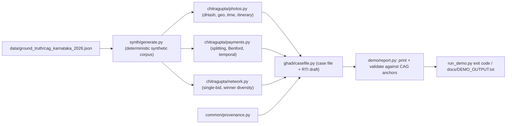

# InnovationForIndia-Optum — SAAKSHI (साक्षी), "the witness for every rupee"

Submission to **TechGig x Optum — Inclusive Innovation for Bharat**, Theme 05 (GovTech & Public Service
Delivery). SAAKSHI is a proposed read-only forensic and accountability layer over India's public
spending data, plus a toll-free multilingual voice channel, that surfaces evidenced, contestable
questions about welfare spending and asks the citizen who can see the asset to verify it.

This repository holds the whole submission: application form, pitch deck, demo video, a static website,
a runnable prototype, and the concept and evidence documents behind them.

## What is in the submission

| Folder | Contents |
|---|---|
| `01_Application_Form/` | `SAAKSHI_Application_FILLED.docx` / `.pdf` |
| `02_Pitch_Deck/` | `SAAKSHI.pptx` |
| `03_Demo_Video/` | `SAAKSHI_demo.mp4` |
| `04_Website/` | static site (`index.html`, `styles.css`, `app.js`, `tour.js`), vanilla HTML/CSS/JS, no build step; opens via `file://` |
| `05_Prototype/` | the runnable prototype — see [`05_Prototype/README.md`](05_Prototype/README.md) |
| `06_Concept_and_Evidence/` | [`idea.md`](06_Concept_and_Evidence/idea.md) (the idea), [`PLAN.md`](06_Concept_and_Evidence/PLAN.md) (the build plan), [`RESEARCH.md`](06_Concept_and_Evidence/RESEARCH.md) (evidence base with reliability markers), [`PRODUCT.md`](06_Concept_and_Evidence/PRODUCT.md) (product schema for the website), [`DESIGN.md`](06_Concept_and_Evidence/DESIGN.md) (visual tokens) |

## The prototype (summary of `05_Prototype/README.md`)

A standard-library-only Python 3.11+ demo (`dependencies = []` in `pyproject.toml`; the production
stack — DuckDB, KuzuDB, imagehash, rasterio, LightGBM, splink, FastAPI — is an optional `prod` extra
and is not needed). It generates a deterministic **synthetic reconstruction** of the March 2026 CAG
Karnataka MGNREGA performance-audit findings and runs SAAKSHI's detectors against it:

- **CHITRAGUPTA photo forensics** (`chitragupta/photos.py`) — dHash near-duplicates across works and
  districts, geo mismatch, timestamps outside the work window, impossible device itineraries.
- **CHITRAGUPTA payment structure** (`chitragupta/payments.py`) — threshold splitting below the
  Rs 5 lakh tender limit, Benford check (flagged as weak signal), stage payments after completion.
- **CHITRAGUPTA network** (`chitragupta/network.py`) — single-bid rate, winner diversity, repeat-winner
  concentration per procuring chain.
- **GHADI case file** (`ghadi/casefile.py`) — accountability case file with an auto-drafted RTI and a
  "What we do not know" section; the detectors are never fused into one score.

`run_demo.py` exits non-zero unless every detector re-derives its seeded CAG target. Captured output is
in `05_Prototype/docs/DEMO_OUTPUT.txt`; the validation anchors are in
`05_Prototype/data/ground_truth/cag_karnataka_2026.json`.

```bash
cd 05_Prototype
python run_demo.py                    # every detector + the case file
python -m unittest discover -s tests  # 10 tests, stdlib only
```

## How the prototype works



## Results (from `05_Prototype/README.md` and `docs/DEMO_OUTPUT.txt`, synthetic data)

Corpus: 484 works, 1,304 payments, 418 photos, 509 tenders. The demo reports a reused completion
photo at Hamming distance 0/64 across two works 61.4 km apart; 462 stage payments after completion
totalling about Rs 1.19 crore (matching the seeded CAG figure); a Rs 2.4L + Rs 2.9L split crossing
the Rs 5L threshold; one device geo-tagging 8 sites in under an hour; and a per-chain single-bid-rate
table. 10/10 tests and 5/5 validation checks pass. Because the dataset was seeded to match published
CAG numbers, these results validate the detectors' logic, not live portal data.

## Status and limitations

- Prototype only; no live ingest, hosting or deployment. The dataset is synthetic; satellite and
  citizen-verification signals in the demo are simulated inputs.
- Team names/contacts in the documents are placeholders and the toll-free number is illustrative
  (stated in `PRODUCT.md`).
- The production layers described in `PLAN.md` (KOSH, NAAM-MILAN, VAANI, PRAMAAN) are not implemented.

## License

The prototype (`05_Prototype/`) is MIT licensed (`05_Prototype/LICENSE`). There is no license file at
the repository root.
